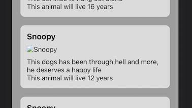

# Props, lists and events 🐾

In this repo you will practise everything covered today.

The project was done with <code>create-react-app</code>, so you just need to run:

```bash
npm install
npm run start
```

## Iteration 1: Print the cards 🧾

On <code>App.jsx</code>:

- Import the hook **useState** and create an "animals" state, with the "setAnimals" updater function. Its initial value should be the animalData array that's already imported from the JSON on App.jsx.
- Use the .map() method to print one card for each animal of the array. Check the <code>Card</code> component to see how the component expects the props.
- ⚠️ Remember that each element inside a map should have a unique key property ⚠️

<details>
<summary>Click here ONLY if you need to see the solution</summary>

```js
// App.jsx

import './App.css';
import React, { useState } from 'react';
import animalData from './data.json';
import Card from './components/Card';

function App() {
  const [animals, setAnimals] = useState(animalData);

  return (
    <div className="App">
      <h1>Adopt me plz 🐾</h1>
      {animals.map(elem => {
        return <Card key={elem._id} animal={elem}/>
      })}
    </div>
  );
}

export default App;
```

</details>

----
## Iteration 2: Conditional rendering 🎯

You will see that some animals don't have an image, and this is the visual result:



We can fix it by using conditional rendering on <code>Card.jsx</code>:

- If the data coming to the Card has a key "image" (if "image" exists), it should display its image, but if it doesn't, it should display this default image: [https://upload.wikimedia.org/wikipedia/commons/thumb/7/70/Dog_silhouette.svg/2067px-Dog_silhouette.svg.png](https://upload.wikimedia.org/wikipedia/commons/thumb/7/70/Dog_silhouette.svg/2067px-Dog_silhouette.svg.png)

- Also, **some animals need medicine**, and its important that you add that information in the Card. This information should appear in color red. 💡 You have a class *red-color* ready for that.

<details>
<summary>Click here ONLY if you need to see the solution</summary>

```js
// components/Card.jsx

import React from 'react'

export default function Card(props) {
  const { animal: { name, lifeExpectancy, description, needsMedicine, image } } = props;
  
  return (
    <div className="card">
      <h3>{name}</h3>
      {image ?  : 
      }
      <p>{description}</p>
      <p>This animal will live {lifeExpectancy} years</p>
      {needsMedicine && <p className="red-color">This animal needs medicine</p>}
    </div>
  )
}
```
</details>

---

## Sort by life expectancy

On <code>App.jsx</code>:

- Create a function called handleSortByLife
- This function should sort the animals array and update the state with a new array, sorted by life expectancy from less years to more years
- Add a button to your app that, when clicked, whill trigger the "handleSortByLife". When creating the button, remember that you have a class for it called *action-btn*.

<details>
<summary>Click here ONLY if you need to see the solution</summary>

```js
// App.jsx

function App() {
  const [animals, setAnimals] = useState(animalData);

  const handleSortByLife = () => {
    const ordered = [...animals].sort((a, b) => a.lifeExpectancy - b.lifeExpectancy)
    setAnimals(ordered);
  }

  return (
    <div className="App">
      <h1>Adopt me plz 🐾</h1>
      <button onClick={handleSortByLife} className="action-btn">Sort by life expectancy</button>
      {animals.map(elem => {
        return <Card key={elem._id} animal={elem}/>
      })}
    </div>
  );
}
```
</details>

---
## Filter dogs

On <code>App.jsx</code>:

Now we want another button that, when clicked, will filter the animals and return **only the dogs**. Try to do that without further instructions and, when you are finished, check at the solution.

You can do it!!! 💪🏼

<details>
<summary>Click here to see the solution</summary>

```js
// App.jsx

import './App.css';
import React, { useState } from 'react';
import animalData from './data.json';
import Card from './components/Card';

function App() {
  const [animals, setAnimals] = useState(animalData);

  const handleSortByLife = () => {
    const ordered = [...animals].sort((a, b) => a.lifeExpectancy - b.lifeExpectancy)
    setAnimals(ordered);
  }

  const handleFilterDogs = () => {
    const filtered = animals.filter(elem => elem.type === "dog");
    setAnimals(filtered);
  }

  return (
    <div className="App">
      <h1>Adopt me plz 🐾</h1>
      <button onClick={handleSortByLife} className="action-btn">Sort by life expectancy</button>
      <button onClick={handleFilterDogs} className="action-btn">See only dogs</button>
      {animals.map(elem => {
        return <Card key={elem._id} animal={elem}/>
      })}
    </div>
  );
}

export default App;
```
</details>

All done ✅


